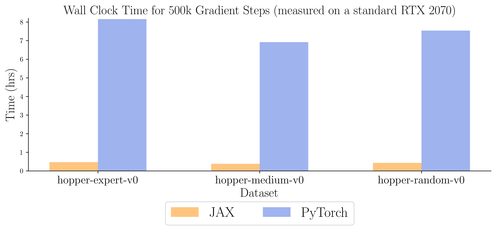

# CQL-JAX

This repository implements Conservative Q Learning for Offline Reinforcement Reinforcement Learning in JAX (FLAX). Implementation is built on top of the SAC base of [JAX-RL](https://github.com/ikostrikov/jaxrl).

## Usage

Install Dependencies-
```
pip install -r requirements.txt
pip install "jax[cuda111]<=0.21.1" -f https://storage.googleapis.com/jax-releases/jax_releases.html
```

Run CQL-
```
python train_offline.py --env_name=hopper-expert-v0 --min_q_weight=5
```
Please use the following values of `min_q_weight` on MuJoCo tasks to reproduce CQL results from [IQL paper](https://arxiv.org/pdf/2110.06169.pdf)-

|Domain|medium|medium-replay|medium-expert|
|:----:|:----:|:-----------:|:-----------:|
|walker|10|1|10|
|hopper|5|5|1|
|cheetah|90|80|100|

For antmaze tasks `min_q_weight=10` is found to work best.

In case of Out-Of Memory errors in JAX, try running with the following env variables-
```
XLA_PYTHON_CLIENT_MEM_FRACTION=0.80 python ...
XLA_FLAGS=--xla_gpu_force_compilation_parallelism=1 python ...
```

## Performance & Runtime

Returns are more or less same as the torch implementation and comparable to IQL-

|Task|CQL(PyTorch)|CQL(JAX)|IQL|
|:--:|:----------:|:------:|:-:|
|hopper-medium-v2|58.5|74.6|66.3|
|hopper-medium-replay-v2|95.0|92.1|94.7|
|hopper-medium-expert-v2|105.4|83.2|91.5|
|antmaze-umaze-v0|74.0|69.5|87.5|
|antmaze-umaze-diverse-v0|84.0|78.7|62.2|
|antmaze-medium-play-v0|61.2|14.2|71.2|
|antmaze-medium-diverse-v0|53.7|10.7|70.2|
|antmaze-large-play-v0|15.8|0.0|39.6|
|antmaze-large-diverse-v0|14.9|0.0|47.5|

Wall-clock time averages to ~50 mins, improving over IQL paper's 80 min CQL and closing the gap with IQL's 20 min.

|Task|CQL(JAX)|IQL|
|:--:|:------:|:-:|
|hopper-medium-v2|52|27|
|hopper-medium-replay-v2|54|30|
|hopper-medium-expert-v2|57|29|

Time efficiency over the original torch implementation is more than 4 times.

<div style="text-align:center"></div>

For more offline RL algorithm implementations, check out the [JAX-RL](https://github.com/ikostrikov/jaxrl), [IQL](https://github.com/ikostrikov/implicit_q_learning) and [rlkit](https://github.com/rail-berkeley/rlkit) repositories.

## Citation

In case you use CQL-JAX for your research, please cite the following-

```
@misc{cqljax,
  author = {Suri, Karush},
  title = {{Conservative Q Learning in JAX.}},
  url = {https://github.com/karush17/cql-jax},
  year = {2021}
}
```

## References

* [Conservative Q Learning for Offline Reinforcement Learning, 2020.](https://arxiv.org/pdf/2006.04779.pdf)
* [A Workflow for Offline Model-Free Robotic Reinforcement Learning, 2021.](https://arxiv.org/pdf/2109.10813.pdf)
* [Offline Reinforcement Learning with Implicit Q-Learning, 2021.](https://arxiv.org/pdf/2110.06169.pdf)
